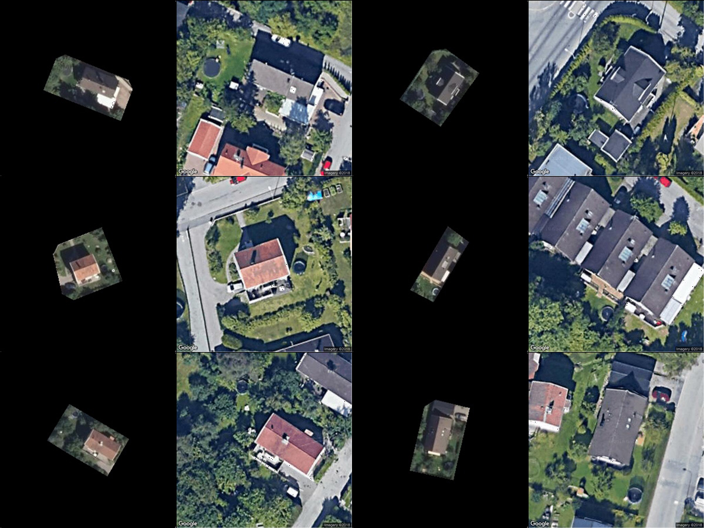
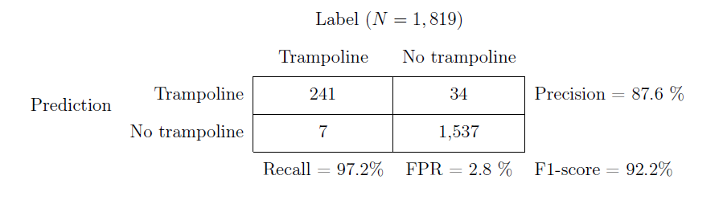
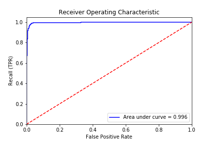
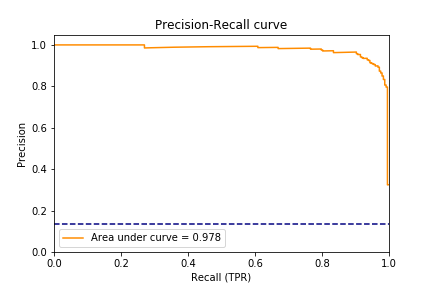
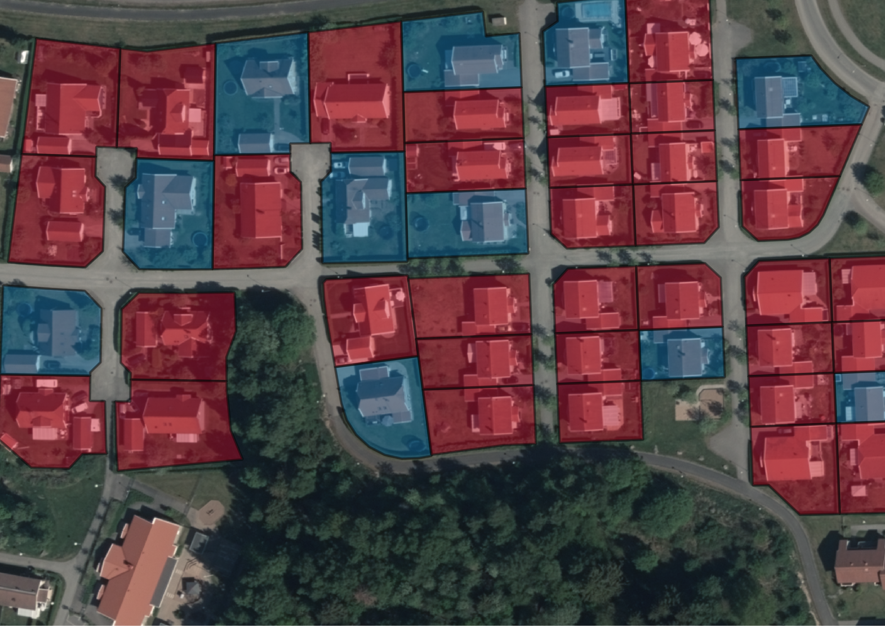

# Trampoline detection using CNN

## Intro

This repo contains some code used in my research project on neighborhood effects in consumption. You can download a working paper on my personal [website](http://erikgrenestam.se/wp-content/uploads/2019/04/Bouncing-with-the-Joneses-ErikG.pdf).

Trampolines are popular among Swedish families. Due to their size and distinct shape, they can be detected from an aerial photo. To collect data on trampoline ownership, I apply an instance of Inception ResNet to a large set of aerial photos of Swedish neighborhoods taken between 2006 and 2018.

## Image preprocessing

Each raw image is a 10,000 by 10,000 pixel GeoTIFF. As my data contains several thousand images, importing all of them into QGIS is not feasible. In ```geotiff_coverage.py```, I extract metadata from each image and it's corresponding json meta file and collect the geographic extent of each image in a shapefile:

```python
import fiona
from shapely.geometry import mapping, shape, box, Point
import os, os.path
from osgeo import gdal

data = gdal.Open(picFolder+file+'.tif', gdal.GA_ReadOnly)
geoTransform = data.GetGeoTransform()
minx = geoTransform[0]
maxy = geoTransform[3]
maxx = minx + geoTransform[1] * data.RasterXSize
miny = maxy + geoTransform[5] * data.RasterYSize
geom = box(minx,miny,maxx,maxy)
img_id = file[0:11]
img_year = file[12:]
yeard[picFolder+file+'.tif'] = int(img_year)
metapath = metaFolder+img_id+'_flygbild_'+img_year+'.json'

with open(metapath) as metafile:    
    metadata = json.load(metafile)
    try:
        img_date = metadata['features'][0]['properties']['tidpunkt'][0:10]
        img_camera = metadata['features'][0]['properties']['kamera']
        dest.write({'geometry': mapping(geom), 'properties':{ 'FILENAME' : file, 
                                                              'ID' : img_id, 
                                                              'DATE': img_date,
                                                              'YEAR': img_year,
                                                              'CAMERA': img_camera}})

```

Using GDAL, I then create virtual mosaics (VRT) containing all the photos from a particular year. To slice each image into chips, each containing a single-family propoerty, I use administrative shapefiles containing the centroid coordinates of every building and polygons for each property parcel. From ```shp_preprocess.py```:

```python
BUILDING_SHP = 'by_all.shp'
LOT_SHP = 'ay_all.shp'
```

Using the building code field in  ```by_all.shp```, I select the subset of land parcels that intersect with a single-family home:

```python
import fiona
from shapely.geometry import shape, mapping

TARGET_SHP = outFolder+'Lots_all_10000.shp'

maxArea = 10000
             
source = fiona.open(LOT_SHP, 'r', encoding='iso-8859-1')     

polygons = [pol for pol in source]
points = [pt for pt in fiona.open(POINTS_SHP)]
    
idx = index.Index()
for pos, poly in enumerate(polygons):
    idx.insert(pos, shape(poly['geometry']).bounds)
    
    #iterate through points
    with fiona.open(TARGET_SHP, 'w', driver=source.driver, crs=source.crs, schema=source.schema) as dest:
        for i,pt in enumerate(points):
            point = shape(pt['geometry'])
            minArea = maxArea
            minpoly = {}
            # iterate through spatial index
            for j in idx.intersection(point.coords[0]):
                print(point.coords)
                geom = shape(polygons[j]["geometry"])
                area = geom.area
                if point.within(geom) and area < maxArea:
                    #only write smallest matching property for each point
                    if area < minArea:
                        minArea = area
                        minpoly = polygons[j]
                if len(minpoly) > 0:
                    print(pt['id'])
                    dest.write(minpoly)
```

With the relevant properties selected, ```cut_imgs.py``` slices the images to 300x300 pixel jpegs (about 75 by 75 meters on the ground). By iterating over the featues in ```TARGET_SHP``` created about, I apply ```gdalwarp``` to the photos with each property outlining the cut. I also set a minimum dimension to discard lots that are too small (30 pixels corresponds to about 7.5 meters). The script also incorporates a simple rotation algorithm that attempts to fit large properties into a 300 by 300 bounding box by rotating them (the ```angel``` argument in the ```toJpeg``` function)

```python
import fiona
from shapely.geometry import shape, box, Point
from shapely.affinity import rotate
import os, os.path
from PIL import Image
from osgeo import gdal

def toJpeg(im,filename,max_side_dim,outFolder,angle):
    size = (max_side_dim, max_side_dim)
    if angle == 0:
        background = Image.new('RGB', size, (0, 0, 0)) 
        background.paste(im, (int((size[0] - im.size[0]) / 2), int((size[1] - im.size[1]) / 2)))
        if background.getbbox():
            background.save(outFolder+filename+'.jpg', 'JPEG', quality = 95)
            print("Jpeg exported.")
            return 1
        else:
            print("All black!")
            return 2
     ...

min_side_dim = 30
max_side_dim = 300

with fiona.open(SOURCE_SHP, 'r') as source:
    for idx, feat in enumerate(source):
            with fiona.open(path=inFolder+"tempfile.shp", mode='w', driver=source.driver, schema=source.schema, crs=source.crs) as tempshp:
                tempshp.write(feat)
            outtile = gdal.Warp(outFolder+newfile+".tif", SOURCE_GTIFF, format = 'GTiff', cutlineDSName=inFolder+"tempfile.shp",                                         cropToCutline=True)
            outtile = None
            im = Image.open(outFolder+newfile+".tif", 'r')
            w, h = im.size
            if min(h, w) > min_side_dim and max(h, w) < max_side_dim:
                r = 0
                cut = toJpeg(im,newfile,max_side_dim,outFolder,r)
```

Using the exported images, I manually label a set of training images (N=22,435). For ambigous cases, I create a script that asks the Google Maps Static API for a reference photo of the same coordinates:

```python
import pickle
import time
import requests

def second_opinion(id,coords,topath):
    GOOGLE_MAPS_API_URL = 'https://maps.googleapis.com/maps/api/staticmap'

    coords = str(coords[1]) + "," + str(coords[0])
    
    params = {
            'key': API_KEY,
            'size': '512x512',
            'maptype': 'satellite',
            'zoom': '20',
            'format': 'jpg',
            'center': coords
        }
    response = requests.get(GOOGLE_MAPS_API_URL, params=params)
    print(response.status_code)
    time.sleep(1)
        
    filepath = topath + '_gmaps.jpg'
    print(filepath)
            
    with open(filepath, 'wb') as f:
        f.write(response.content)

#pickled dictionary with unique property id and centroid coordinate (WGS84)
ay_dict = pickle.load(open("ay_point_wgs.p", "rb" ))

second_opinion(id_dict, ay_dict.get(id_dict), topath) 

```

Since the Google Maps image is often of higher resolution than my source images, it can facilitate labeling in ambigous cases as shown here:

<p align="center">  


## Training

For training, I use the Keras implementation of Inception ResNet which I instantiate with pre-trained ImageNet weights and a Tensorflow GPU backend. All training is done on an Nvidia GTX1080Ti.

```python
    
from keras import Model
from keras.applications.inception_resnet_v2 import InceptionResNetV2
from keras.applications.inception_resnet_v2 import preprocess_input
from keras.preprocessing.image import ImageDataGenerator
from keras.callbacks import Callback
from keras.callbacks import ModelCheckpoint
from keras.layers.core import Dense
from keras.layers import Input
from keras.models import Sequential
from keras.optimizers import Adam

in_shape = (300,300,3)
input = Input(shape=in_shape,name = 'image_input')

#parameters
EPOCHS = 30
BATCH_SIZE = 32
LR = 0.001
DECAY = 0.001
MOMENTUM = 0.9
BETA_1 = 0.9
BETA_2 = 0.999
EPSILON = 1e-08

#model
base_model = InceptionResNetV2(include_top=False, weights='imagenet', input_tensor=None, input_shape=in_shape, pooling='avg')

top_model = Sequential()
top_model.add(Dense(1, input_shape=(base_model.output_shape[1:]), activation='sigmoid'))
model = Model(inputs=base_model.input, outputs= top_model(base_model.output))

adam = Adam(lr=LR, beta_1=BETA_1, beta_2=BETA_2, epsilon=EPSILON, decay=0.0, amsgrad=False)
model.compile(optimizer='adam', loss='binary_crossentropy', metrics = ['accuracy'])

model.summary()
```

I split my training data 80-10-10. To adress the trampoline/no trampoline imbalance I manually oversample the tramploline class to achieve a 50-50 balance for training and validation. I use the ```flow_from_directory``` method and standard augmentation techniques (flip, shift and rotate)

```python
train_datagen = ImageDataGenerator(
    width_shift_range=0.1,
    height_shift_range=0.1,
    vertical_flip=True,
    rotation_range=90,
    horizontal_flip=True,
    samplewise_center=False,
    samplewise_std_normalization=False,
    preprocessing_function=preprocess_input
    )

train_generator = train_datagen.flow_from_directory(
    train_dir,
    target_size=img_size,
    batch_size=BATCH_SIZE,
    shuffle=True,
    class_mode='binary')
```

I also create callback objects for logging and for gradually reducing the learning rate as the validation accuracy stops improving. The ```LrReducer``` class allows the user to set parameters that determine the learning rate reduction and early stopping conditions.

```python
logCallback = EndCallback(timestr)
lrReduce = LrReducer()

filepath = model_path+"/ResNet-{epoch:02d}-{val_acc:.3f}.h5"  # unique file name that will include the epoch and the validation acc for that epoch
Checkpoint = ModelCheckpoint(filepath, monitor='val_acc', verbose=1, save_best_only=True, mode='max') # saves only the best ones

model.fit_generator(
    train_generator,
    steps_per_epoch=int(train_size/BATCH_SIZE),
    epochs=EPOCHS,
    validation_data=validation_generator,
    validation_steps=int(val_size/BATCH_SIZE), callbacks=[logCallback, lrReduce, Checkpoint])

model.save_weights("models/{}_weights.h5".format(NAME))
model.save("models/{}.h5".format(NAME))
```

## Testing

I evaluate final model performance on the test set of manually labeled images (N = 1,819):
<p align="center">
    
<p align="center">
        
    
### Visualizing the result

To visualize the prediction, I can overlay the predicted class for each property on the original photo (red = 'No trampoline', blue = 'Trampoline')

<p align="center">
    
